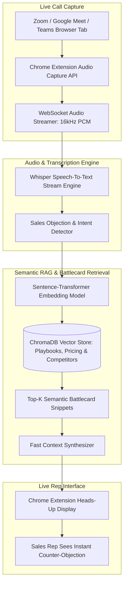

# 🎙️ Sales Copilot — Real-Time Voice AI & ChromaDB Semantic Sales Assistant

<div align="center">

[](https://python.org)
[](https://fastapi.tiangolo.com)
[](https://trychroma.com)
[](#)
[](https://openai.com/research/whisper)
[](LICENSE)
[](https://github.com/muhammadokashapak)

<p align="center">
  <strong>Live In-Call Objection Handling, Product Knowledge Retrieval & Real-Time Battlecards Powered by Whisper Speech-To-Text and Vector RAG</strong>
</p>

[📖 Overview](#-overview) •
[⚡ Architecture & Data Flow](#-real-time-data-flow-architecture) •
[✨ Core Capabilities](#-core-capabilities) •
[📂 Directory Structure](#-directory-structure) •
[🚀 Quickstart](#-quickstart--installation) •
[👨‍💻 Author](#-author--connect)

---

</div>

## 📖 Overview

Sales representatives during live discovery and demo calls frequently face unexpected customer objections, detailed technical questions, and pricing comparisons. Flipping through static PDF playbooks, internal wikis, or competitor sheets mid-call distracts the rep and harms conversion rates.

**Sales Copilot** is a real-time sales intelligence system consisting of a lightweight **Google Chrome Extension (Manifest V3)** and a high-performance **Python / FastAPI / ChromaDB** backend. By listening to live conversation audio, the system automatically transcribes prospect inquiries using Faster-Whisper, performs semantic vector retrieval against product knowledge bases, and flashes instant, contextual objection-handling cards directly on the rep's screen in **< 800 milliseconds**.

---

## ⚡ Real-Time Data Flow Architecture



---

## ✨ Core Capabilities

- 🎯 **Sub-Second Objection Handling:** Detects competitor mentions (e.g., *"Why should we choose you over Salesforce?"*) and displays counter-points instantly.
- 🎧 **Universal Browser Audio Capture:** Works seamlessly across Google Meet, Zoom Web, Microsoft Teams, and dialers via Chrome tab audio capture.
- 📚 **ChromaDB Semantic Vector Index:** Ingests product documentation, pricing tiers, security compliance sheets, and case study metrics.
- 🔒 **Local & Confidential:** Vectors and speech pipelines can run entirely on-premise without exposing private enterprise sales negotiations.

---

## 📂 Directory Structure

```
Sales-Voice-Copilot/
│
├── chrome_extension/          # Manifest V3 browser extension
│   ├── manifest.json          # Extension configuration & tab permissions
│   ├── background.js          # Audio stream capture & WebSocket transport
│   ├── content.js             # Real-time heads-up overlay injection
│   └── popup.html             # Extension activation UI
├── chroma_db_v2/              # Persistent ChromaDB vector collections & index
├── rag_engine.py              # Semantic retrieval & battlecard ranking logic
├── rag_app.py                 # FastAPI server & real-time WebSocket endpoints
├── stt_engine.py              # Live audio chunking & Whisper transcription
├── run_assistant.py           # Unified launcher for backend services
├── requirements.txt           # Python dependency specification
└── README.md                  # VIP Master Architecture Documentation
```

---

## 🚀 Quickstart & Installation

### 1. Backend Server Setup
```bash
git clone https://github.com/muhammadokashapak/Sales-Voice-Copilot.git
cd Sales-Voice-Copilot

python -m venv venv
.\venv\Scripts\activate   # Linux/macOS: source venv/bin/activate

pip install -r requirements.txt
python run_assistant.py
```
The FastAPI WebSocket server will launch on `ws://localhost:8000`.

### 2. Chrome Extension Installation
1. Open Google Chrome and navigate to `chrome://extensions/`.
2. Enable **Developer mode** (top right toggle).
3. Click **Load unpacked** and select the `chrome_extension/` directory.
4. Click the Sales Copilot icon on your browser toolbar and join any Google Meet or Zoom call to receive live battlecard assistance!

---

## 👨‍💻 Author & Connect

**Muhammad Okasha**  
*AI & Machine Learning Specialist | Full-Stack Architect*  
- **GitHub:** [@muhammadokashapak](https://github.com/muhammadokashapak)
- **Repository:** [Sales-Voice-Copilot](https://github.com/muhammadokashapak/Sales-Voice-Copilot)

---

## 📄 License
This project is licensed under the [MIT License](LICENSE).
